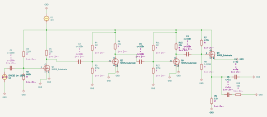

# MOSFET Amplifier Design

[](https://github.com/BhavyaPatel0306/mosfet-amplifier/actions/workflows/package-checks.yml)

**Four stages. A 3.3 V supply. A study in gain, bandwidth, power, and output headroom.**

An analog electronics project for **ELE404: Electronics I at Toronto Metropolitan University**, built in **KiCad 9** with the supplied NMOS models. Three common-source stages provide voltage gain; a common-drain stage buffers the output.

[Read the report](docs/project-report.pdf) · [Open the design](hardware/ELE404Project.kicad_pro) · [Reproduce the analysis](docs/SIMULATION.md) · [Results and limitations](docs/RESULTS.md)



*Fresh export of the actual committed circuit. The original report illustrates a different revision; experimental changes are kept in a separate netlist.*

## What this project explores

- **Cascaded voltage gain:** distributing amplification across three common-source stages.
- **Independent DC biasing:** resistor dividers and interstage AC coupling.
- **Load driving:** using a source follower to reduce output impedance.
- **Engineering trade-offs:** balancing low power against output swing and clipping.


*Conceptual signal path described in the report; bias and bypass networks are omitted.*

## Fresh simulation evidence

**v0.2.0 includes actual ngspice 44 runs**, raw CSV data, a reproducible runner, and a separate experimental circuit.

- **Original circuit:** 64.82 dB loaded gain, approximately 14.29 MHz upper cutoff, and **1.0208 mW DC power**. Its 1.510 Vpp waveform at 1 mV peak input has **27.91% THD** and clips.
- **Experimental variant:** 61.16 dB loaded gain and **0.9201 mW DC power**. At 0.75 mV peak input it produces **1.568 Vpp with 4.00% THD**.

The variant is a measured improvement at the stated input amplitudes, **not a fully compliant replacement**. Gain-stage overdrive is below the guideline, transient follower current exceeds 200 uA, and clean-swing acceptance still needs a defined distortion limit. The original KiCad circuit is preserved.


[Measured results and limits](docs/VERIFICATION.md) · [Repeat the runs](simulations/README.md) · [Historical report results](docs/RESULTS.md) · [Versioned releases](https://github.com/BhavyaPatel0306/mosfet-amplifier/releases)

## Get started

1. Download **Code → Download ZIP** and extract it, or clone the repository:

   ```sh
   git clone https://github.com/BhavyaPatel0306/mosfet-amplifier.git
   cd mosfet-amplifier
   ```

2. Open [`hardware/ELE404Project.kicad_pro`](hardware/ELE404Project.kicad_pro) in KiCad 9, then open the schematic.
3. Keep `hardware/models/` alongside the project. All four transistor model references use `models/nmos_t.txt`.
4. Follow the [simulation guide](docs/SIMULATION.md) before running the saved workbook.

**Verification status:** fresh ngspice DC/AC/transient runs and package checks are documented. GitHub Actions checks packaging, not electrical performance. No KiCad GUI/ERC validation or PCB layout validation is claimed; the PCB remains a placeholder.

## Repository guide

```text
mosfet-amplifier/
├── hardware/                 KiCad project, schematic, simulator workbook
│   └── models/               Supplied NMOS and PMOS models
├── docs/
│   ├── project-report.pdf    Original ten-page report
│   ├── design-guidelines.pdf Original assignment specifications
│   ├── SIMULATION.md         Setup and measurement procedure
│   ├── RESULTS.md            Evidence and limitations
│   ├── ROADMAP.md            Prioritized engineering improvements
│   └── images/               Figures extracted from the report
├── simulations/              Portable netlists, raw results, and comparison plots
├── originals/                Untouched project ZIP, including backups
├── scripts/verify_package.py File-integrity and model-reference checks
├── CONTRIBUTING.md           How to submit reproducible improvements
├── RECOVERY.md               Packaging provenance
└── SHA256SUMS.txt            Checksums for distributed files
```

Check the downloaded package with Python 3:

```sh
python scripts/verify_package.py
```

This checks hashes, model references, saved JSON files, and original archive integrity. **It does not simulate the amplifier.**

## Next design steps

The baseline is now simulated and documented. Next, resolve overdrive, distortion, and peak-current constraints before moving an experimental redesign into KiCad. See the [roadmap](docs/ROADMAP.md).

## Source material and reuse

The report, assignment, models, and original archive are preserved from the supplied materials. Images are extracted from that report. No new license has been applied; public visibility does not itself grant reuse rights to third-party course or model materials.
