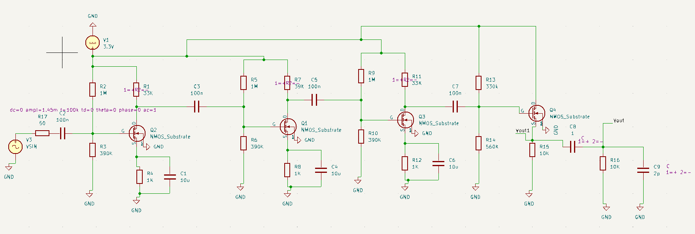
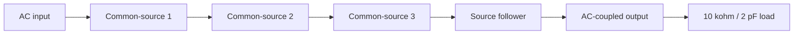
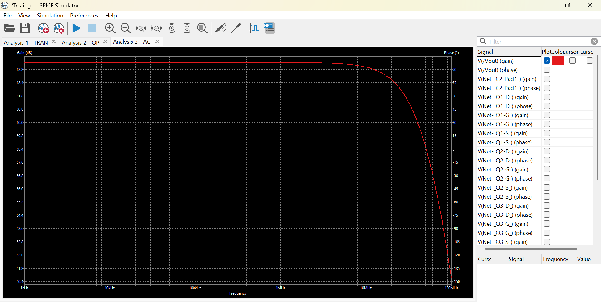

# MOSFET Amplifier Design

**Four stages. A 3.3 V supply. A study in gain, bandwidth, power, and output headroom.**

An analog electronics project for **ELE404: Electronics I at Toronto Metropolitan University**, built in **KiCad 9** with the supplied NMOS models. Three common-source stages provide voltage gain; a common-drain stage buffers the output.

[Read the report](docs/project-report.pdf) · [Open the design](hardware/ELE404Project.kicad_pro) · [Reproduce the analysis](docs/SIMULATION.md) · [Results and limitations](docs/RESULTS.md)



*Schematic from the original report, not a fresh export of the current project. See the [known differences](docs/SIMULATION.md#known-differences) before reproducing the results.*

## What this project explores

- **Cascaded voltage gain:** distributing amplification across three common-source stages.
- **Independent DC biasing:** resistor dividers and interstage AC coupling.
- **Load driving:** using a source follower to reduce output impedance.
- **Engineering trade-offs:** balancing low power against output swing and clipping.



*Conceptual signal path described in the report; bias and bypass networks are omitted.*

## Reported performance

The original report records **63.8 dB loaded gain**, **64.6 dB unloaded gain**, approximately **20 MHz bandwidth**, and **0.828 mW DC power**. These are historical report values, **not independently reproduced results**.

The reported **1.33 Vpp output swing falls below the 1.5 Vpp target**. The transient plot also shows clipping, so that value must not be presented as a verified clean output swing. This is a documented design study with an unresolved output-stage limitation.



*Original report figure. A saved plot is supporting documentation, not a substitute for a reproducible simulation run.*

Read the [results notes](docs/RESULTS.md) for the load-sensitivity correction and evidence sources.

## Get started

1. Download **Code → Download ZIP** and extract it, or clone the repository:

   ```sh
   git clone https://github.com/BhavyaPatel0306/mosfet-amplifier.git
   cd mosfet-amplifier
   ```

2. Open [`hardware/ELE404Project.kicad_pro`](hardware/ELE404Project.kicad_pro) in KiCad 9, then open the schematic.
3. Keep `hardware/models/` alongside the project. All four transistor model references use `models/nmos_t.txt`.
4. Follow the [simulation guide](docs/SIMULATION.md) before running the saved workbook.

**Verification status:** file integrity and package structure have been checked. No fresh SPICE simulations, KiCad GUI validation, or electrical-rule checks were performed during repository preparation. The PCB file is a placeholder, not a completed layout.

## Repository guide

```text
mosfet-amplifier/
├── hardware/                 KiCad project, schematic, simulator workbook
│   └── models/               Supplied NMOS and PMOS models
├── docs/
│   ├── project-report.pdf    Original ten-page report
│   ├── design-guidelines.pdf Original assignment specifications
│   ├── SIMULATION.md         Setup and measurement procedure
│   ├── RESULTS.md            Evidence and limitations
│   ├── ROADMAP.md            Prioritized engineering improvements
│   └── images/               Figures extracted from the report
├── originals/                Untouched project ZIP, including backups
├── scripts/verify_package.py File-integrity and model-reference checks
├── CONTRIBUTING.md           How to submit reproducible improvements
├── RECOVERY.md               Packaging provenance
└── SHA256SUMS.txt            Checksums for distributed files
```

Check the downloaded package with Python 3:

```sh
python scripts/verify_package.py
```

This checks hashes, model references, saved JSON files, and original archive integrity. **It does not simulate the amplifier.**

## Next design steps

Reproduce the saved circuit, reconcile its settings with the report, investigate output-stage clipping, and capture raw data with the exact simulator configuration. See the [roadmap](docs/ROADMAP.md).

## Source material and reuse

The report, assignment, models, and original archive are preserved from the supplied materials. Images are extracted from that report. No new license has been applied; public visibility does not itself grant reuse rights to third-party course or model materials.
