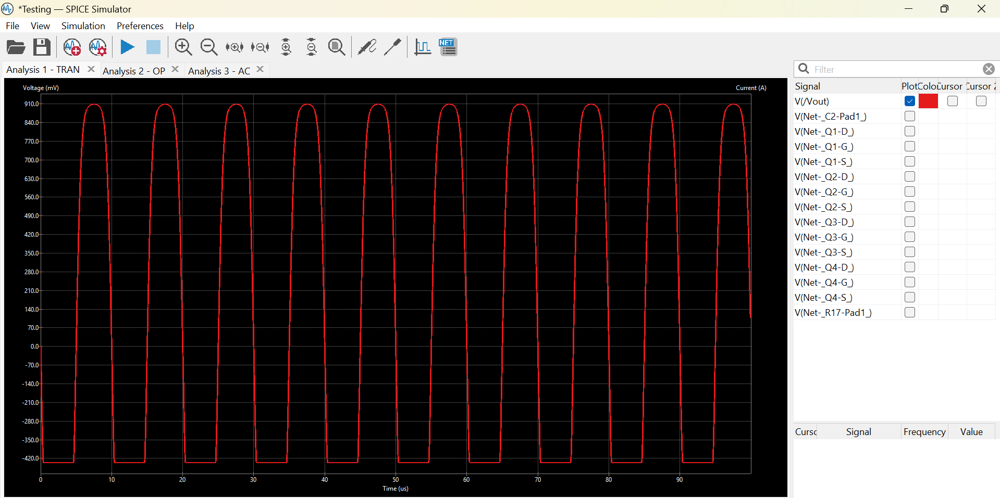

# Results, evidence, and limitations

**Fresh runs are now available:** see [v0.2.0 verification](VERIFICATION.md) and [raw results](../simulations/results/summary.json). The remainder of this page describes the historical report.

## Evidence boundary

The [original report](project-report.pdf) contains the author's simulation discussion and screenshots. Fresh runs of the supplied circuit give different results; see the verification link above. The [guidelines](design-guidelines.pdf) define the targets. Both PDFs remain unchanged.

## Historical report values

- **Loaded gain:** 63.8 dB, report page 7.
- **Unloaded gain:** 64.6 dB, page 7; target at least 60 dB.
- **Upper -3 dB bandwidth:** approximately 20 MHz, page 7; target at least 500 kHz. The current saved sweep stops at 10 MHz, so a new run needs a wider range.
- **DC power:** 0.828 mW at a reported 251 uA total current, page 6; limit 1 mW.
- **Output swing:** approximately 1.33 Vpp, pages 8–9; target at least 1.5 Vpp. The figure shows clipping, so it does not establish a clean 1.33 Vpp swing.

Other requirements, including input resistance, per-stage gain, sizing, overdrive, and maximum branch current, require consistent fresh verification before claiming full compliance.

## Load-sensitivity correction

The report lists 1.54% load sensitivity. Percent voltage-gain reduction must use linear gains, not percentage changes in dB values. From the rounded reported gains:

```text
100 × (1 − 10^((63.8 − 64.6)/20)) ≈ 8.80%
```

This is arithmetic on reported numbers, not a new measurement. It is below the 10% limit if the gains are reproduced under comparable conditions.

## Output-stage limitation



The output has a flattened negative excursion. Investigate device operating points and transient currents before selecting a redesign. The existing evidence does not establish a distortion-qualified output swing.

## Figure provenance

- `images/reported-schematic.png`: embedded schematic, report page 6.
- `images/reported-ac-response.png`: embedded AC plot, report page 7.
- `images/reported-transient.png`: embedded transient plot, report page 8.

Figures were extracted without redrawing the circuit or regenerating curves. They show the report revision, which differs from the supplied project in source settings and sweep range. See [SIMULATION.md](SIMULATION.md#known-differences).

## Verification scope

File hashes, original ZIP CRC, relative model references, and KiCad project/workbook JSON parsing are package checks. They do not demonstrate circuit correctness, model compatibility, fabrication readiness, or simulation success by themselves. The separately documented ngspice runs provide the fresh simulation evidence.
