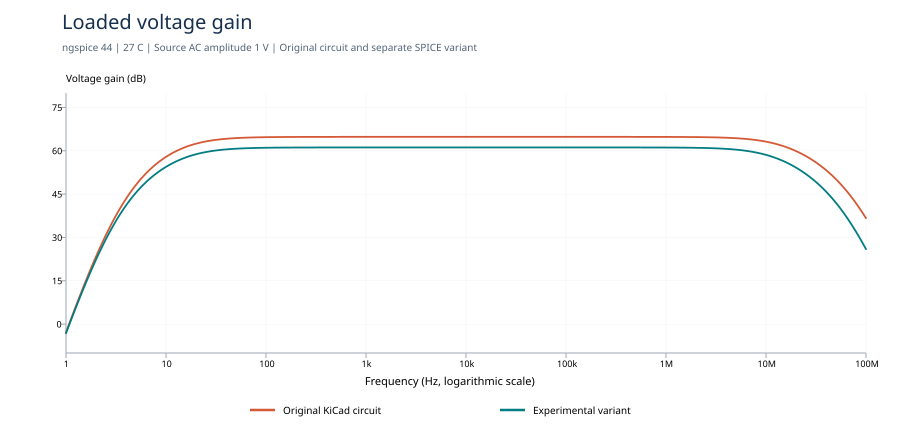
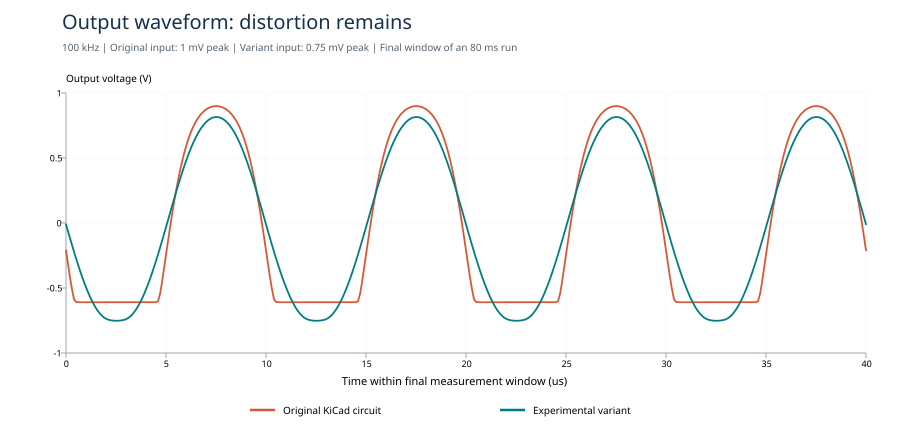

# Fresh simulation results — v0.2.0

These results were actually run with **ngspice 44**, using a **KiCad 9.0.4 export** and the supplied model files. They supersede assumptions that the original report describes the committed circuit. Full settings, hashes, CSV data, and logs are available in [simulations/](../simulations/README.md).

## Original KiCad circuit

- DC supply power: **1.0208 mW**, above the **1 mW** maximum.
- Gain at 100 kHz: **64.82 dB loaded**, **65.67 dB unloaded** with a 1 Tohm DC output reference.
- Upper cutoff relative to the 100 kHz gain: approximately **14.29 MHz**.
- Load-related voltage-gain reduction: approximately **9.34%**.
- At the saved **1 mV peak, 100 kHz** input: approximately **1.510 Vpp**, with **27.91% THD** over harmonics 2–10. This is clipped output, not a successful clean-swing result.
- Follower drain-current peak in the final transient window: approximately **288 uA**; its minimum approaches zero, consistent with cutoff.

The saved AC source magnitude is **zero** and produces zero AC response. Only the AC transfer-function measurement overrides it to 1. The original schematic is preserved.

The baseline also lacks the specified 50-ohm input source resistor and places its 2 pF capacitor before the output coupling capacitor. Its gain-stage overdrives, using model VGS minus VTH, are approximately **0.045 V, 0.144 V, and 0.144 V**, below the guideline's 0.2 V lower bound.

## Experimental variant

- DC supply power: **0.9201 mW**.
- Gain at 100 kHz: **61.16 dB loaded**, **61.69 dB unloaded**.
- Upper cutoff relative to the 100 kHz gain: approximately **11.02 MHz**.
- Load-related voltage-gain reduction: approximately **5.91%**.
- At **0.75 mV peak, 100 kHz** input: approximately **1.568 Vpp**, with **4.00% THD** over harmonics 2–10.
- Follower current remains above zero in the sampled final window, but peaks near **307 uA**.

This variant improves nominal power and reduces distortion at the stated test amplitudes. The comparison is not at identical input amplitudes. It remains **experimental**: its gain-stage overdrives are approximately **0.077–0.079 V**, below the 0.2 V guideline. Its transient current also exceeds 200 uA; only its DC branch currents are below that number. Until the branch-current interpretation and other requirements are resolved, it must not be called fully compliant.

The assignment does not specify a THD threshold. Reporting 1.568 Vpp therefore does not establish an acceptable clean swing. A stricter 1% THD criterion would fail at this operating point.

## Settling check

The default transient runs to 80 ms and compares the last 100 us with a 100 us window 20 ms earlier. Output Vpp changed by approximately **−0.137% for the baseline** and **+0.0077% for the variant**. This suggests modest residual drift at the measured windows; it is not a proof of convergence for every quantity or every operating condition.

## What changed and what did not

The committed KiCad schematic, transistor models, original PDFs, and original ZIP remain unchanged. The current schematic preview is a fresh export with a tighter viewport. All experimental circuit changes exist only in `simulations/netlists/candidate.cir` and are listed in the [run guide](../simulations/README.md).

No claim is made about measured hardware performance, manufacturing readiness, temperature/process corners, or complete assignment compliance. Further transistor sizing and bias work is required before promoting the candidate into the KiCad design.
